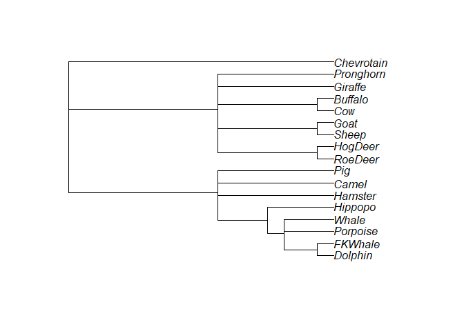

Readme
================
2023-04-26

<!-- README.md is generated from README.Rmd. Please edit that file -->

# BayesTraitR

<!-- badges: start -->
<!-- badges: end -->

The goal of BayesTraitR is to facilitate phylogenetic comparative
analyses in BayesTraits for R users. It comprises a suite of functions
and tools that will be useful for wrangling datasets and trees into the
appropriate format for analyses within BayesTraits as well as for
interpreting and post-processing the outcomes of such analyses.

## Installation

You can install the development version of BayesTraitR from
[GitHub](https://github.com/) with:

``` r
# install.packages("devtools")
devtools::install_github("joannabaker/BayesTraitR")
```

You can download the latest version of
[BayesTraits](http://www.evolution.reading.ac.uk/BayesTraitsV4.0.1/BayesTraitsV4.0.1.html)
from the University of Reading website. Note that this package has been
developed with the output from BayesTraitsV4.0.1 and different versions
of the program may produce incompatible outputs.

## Example Data

This package contains sample brain and body size data for marsupials,
taken from the forthcoming publication:

Venditti C, Baker J & Barton, R (2023) *Co-evolutionary dynamics of
mammalian brain and body size*, Currently **in review**.


