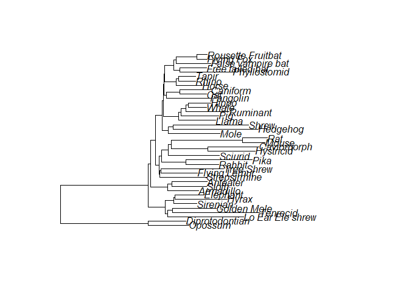

Creating and post-processing variable rates models
================
2025-07-15

There is a specific set of commands and functions associated with the
[variable rates model](https://www.nature.com/articles/nature10516) and
the [variable rates regression
model](https://academic.oup.com/biolinnean/article-abstract/118/1/95/2440206).
We can use these functions to import the files output by variable rates
analyses into R and post-process into results ready for interpretation.

There are three types of variable rates models that can be run that each
have very slight differences in the output files.

1)  A variable rates model

2)  A variable rates model across a sample of trees

3)  A variable rates model across a tree sample, forcing equal tree
    sampling. Note that this option is not limited to variable rates
    models and is equivalent to running analyses sequentially across
    each tree.

All of these models are run in the same way with one exception - for a
single-trait variable rates model we choose model option 9 rather than
model option 7 when running BayesTraits. For simplicity, the current
tutorial is for a single-trait variable rates model. More complex
examples may be integrated in the future.

## Step 1: Generate the input files

We can create a single-trait variable rates model over a single tree
using the example files that are bundled with the BayesTraits download.
These example files are also included as a part of this package. Please
note that for this and all worked examples, the datasets are small and
incomplete and should not be used for any scientific interpretation.
They are included as illustrative examples of how to interact with
BayesTraits and BayesTraitR only.

To **create a single-trait variable rates model** across the Mammal
dataset and tree sample, we can use the following commands:

``` r
createBTjob(cols = "Body", dataset = MammalBody, tree = Mammal_trees, jobname = "MammalBody_VR", model = 7, MCMC = T, optarg = c("varrates", "stones 500 10000"))
```

Note that we specify the following arguments, along with the dataset and
tree objects:

- **`jobname = "MammalBody_VR`“**: This sets an identifier string with
  which all output files will be tagged.

- **`cols = "Body"`**: This specifies the column we wish to run the
  model over in the input dataset.

- \*\*`model = 7**`: This specifies the independent-contrast model for a
  single trait. Note that this does not output contrasts but instead
  uses the fast likelihood calculation in order to estimate complex
  model parameterization such as the variable rates models.

- **`MCMC = T`**: The variable rates model is only available for MCMC
  analyses.

We also specify the following optional arguments using the **optarg =
c(…)** argument:

- **`varrates`** Specifies the model should estimate variable rates.

- **`stones 500 10000`** Specifies that the model should be run with
  stepping-stone sampling. The model will run 500 stones for 10,000
  iterations per stone.

All other parameters are set to the default values.

This will create a series of files in your current working directory:

- MammalBody_VR-001.txt

- MammalBody_VR.trees

- MammalBody_VR.infile

## Step 2: Run the analysis

These files can then be used to run BayesTraits, either separately
through your command-line interface or using shell (or similar) options
direction from within R.

``` r
shell("BayesTraitsV4.exe MammalBody_VR.trees MammalBody_VR-001.txt < MammalBody_VR.infile")
```

This will create a number of output files in your current working
directory:

- MammalBody-001.txt.Log.txt

- MammalBody-001.txt.Output.trees

- MammalBody-001.txt.Schedule.txt

- MammalBody-001.txt.Stones.txt

- MammalBody-001.txt.VarRates.txt

## Step 3: Post-process the analysis

Now, we can read in the log file into our R workspace using `readBTlog`.

``` r
log = readBTlog("inst/extdata/MammalBody_VR-001.txt.Log.txt")
```

We can view this like we would any other R data.frame. Let’s look at
what the output looks like.

``` r
head(log)
#>   Iteration        Lh Tree No   Alpha 1 Sigma^2 1 No RJ Local Branch
#> 1    101000 -76.44423       1 3.6281597 13.405556                  2
#> 2    102000 -70.22336      13 3.8568553 12.298780                  2
#> 3    103000 -74.77264      11 0.3157505 25.232322                  4
#> 4    104000 -77.70826       7 4.7431700 28.329506                  4
#> 5    105000 -68.29602      10 2.6831073  6.524745                  5
#> 6    106000 -77.34678      32 1.5164226 37.779341                  2
#>   No RJ Local Node <NA>
#> 1                1   NA
#> 2                5   NA
#> 3                0   NA
#> 4                1   NA
#> 5                3   NA
#> 6                0   NA
```

Let’s summarize the variable rates output, and create a stretched tree :

``` r
res = summarizeVR(vrfile = "inst/extdata/MammalBody_VR-001.txt.VarRates.txt", tree = read.nexus("inst/extdata/Mammal_Consensus.trees"))
#> Extracting VR information from file...
#>  Linking to tree...
#>      Summarizing Rates...

stretchedtree = scaleTree(res, frequency = 95, magnitude = 1, type = "mean")


plot(stretchedtree)
```



**NOTE**: because we input a sample of trees, we must specify only a
single tree to summarize on. Here we calculate and use a consensus tree
but this can be any tree of your choice - as long as it contains the
same taxa that were included in the analysis.

Any branches that were stretched that do not exist in your single
summarizing tree will be assigned to their most recent common ancestor.

## Step 4: Plot the rates and trees

**Coming soon…**
